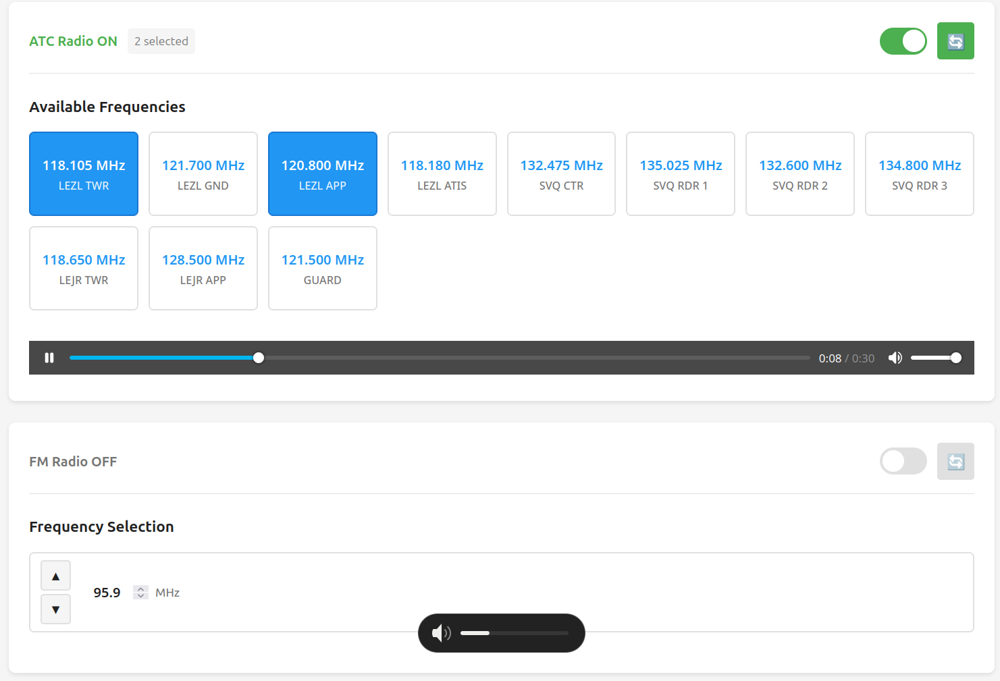

# web-sdr

Web-based player and control interface for live radio streaming using a RTL-SDR dongle.

Main features:
- Airband/ATC playback on one or more pre-defined frequencies at a time.
- High-quality FM stereo playback with a frequency selector.
- Low CPU requirements, suitable for Raspberry Pi and other embedded devices.
- Automatic radio shutdown after all listeners have disconnected.
- State sync across multiple simultaneous listeners.



# Requirements
- Python + Flask
- FFmpeg
- A connection to an [icecast](https://icecast.org/) server
- [RTL-SDR drivers](https://github.com/osmocom/rtl-sdr) installed
- **For airband radio:** [RTLSDR-Airband](https://github.com/rtl-airband/RTLSDR-Airband)
- **For FM radio:** [SoftFM](https://github.com/zf-lab/SoftFM) (if you're using a headless device, consider using [this fork](https://github.com/agubelu/SoftFM) which removes the ALSA dependency)

# Icecast and stream continuity

When switching frequencies, the underlying `rtl_airband` or `softfm` process is terminated and re-spawned with the new configuration. This causes the icecast stream to stop and re-start, which would normally require a refresh on the client side.

In order to have a continuous stream and switch frequences seamlessly without restarting the client, we use ffmpeg to generate a silence loop that is used as fallback for the main audio stream. This requires configuring icecast to automatically transition listeners to the silence loop when the live stream stops and back again when it restarts.

To do this, add these sections to the icecast config file (normally `/etc/icecast2/icecast.xml`), inside the main `<icecast>` tag:

```xml
<mount type="normal">
    <mount-name>/feed.mp3</mount-name>
    <fallback-mount>/silence.mp3</fallback-mount>
    <fallback-override>1</fallback-override>
    <!-- How long to wait before considering source dead -->
    <source-timeout>10</source-timeout>
</mount>

<mount type="normal">
    <mount-name>/silence.mp3</mount-name>
</mount>
```

The names for the `/feed.mp3` and `/silence.mp3` feeds can be changed, but they must also be updated in the `icecast.{live,silence}_mountpoint` parameters in `config.py`.

# Disclaimer
Many jurisdictions forbid publicly rebroadcasting ATC communications. When using this software, please make sure to comply with all applicable local laws and regulations.
